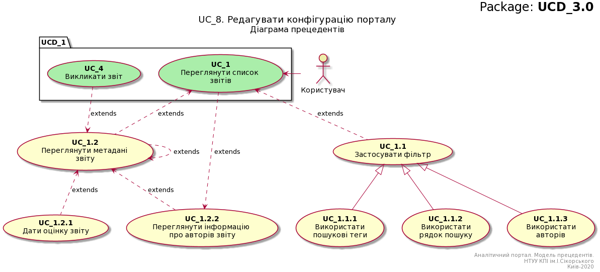

# Модель прецедентів

В цьому файлі необхідно перелічити всі документи, розроблені в проекті та дати посилання на них.

*Модель прецедентів повинна містити загальні оглядові діаграми та специфікації прецедентів.*


Вбудовування зображень діаграм здійснюється з використанням сервісу [UML Editor](https://jace-dev.herokuapp.com/design/uml-editor#/), що створений Андрієм Болдаком. 

В markdown-файлі використовується опис діаграми.

**Діаграма прецедентів**

```md
@startuml

    right header
        <font size=24 color=black>Package: <b>UCD_3.0
    end header

    title
        <font size=18 color=black>UC_8. Редагувати конфігурацію порталу
        <font size=16 color=black>Діаграма прецедентів
    end title


    actor "Користувач" as User #eeeeaa
    
    package UCD_1{
        usecase "<b>UC_1</b>\nПереглянути список \nзвітів" as UC_1 #aaeeaa
    }
    
    usecase "<b>UC_1.1</b>\nЗастосувати фільтр" as UC_1.1
    usecase "<b>UC_1.2</b>\nПереглянути метадані \nзвіту" as UC_1.2  
    usecase "<b>UC_1.2.1</b>\nДати оцінку звіту" as UC_1.2.1  
    usecase "<b>UC_1.2.2</b>\nПереглянути інформацію \nпро авторів звіту" as UC_1.2.2
    
    package UCD_1 {
        usecase "<b>UC_4</b>\nВикликати звіт" as UC_4 #aaeeaa
    }
    
    usecase "<b>UC_1.1.1</b>\n Використати \nпошукові теги" as UC_1.1.1  
    usecase "<b>UC_1.1.2</b>\n Використати \nрядок пошуку" as UC_1.1.2
    usecase "<b>UC_1.1.3</b>\n Використати \nавторів" as UC_1.1.3  
    
    
    
    User -> UC_1
    UC_1.1 .u.> UC_1 :extends
    UC_1.2 .u.> UC_1 :extends
    UC_4 .d.> UC_1.2 :extends
    UC_1.2 .> UC_1.2 :extends
    UC_1.2.1 .u.> UC_1.2 :extends
    UC_1.2.2 .u.> UC_1.2 :extends
    UC_1 ..> UC_1.2.2 :extends
    
    
    UC_1.1.1 -u-|> UC_1.1
    UC_1.1.2 -u-|> UC_1.1
    UC_1.1.3 -u-|> UC_1.1
    
    right footer
        Аналітичний портал. Модель прецедентів.
        НТУУ КПІ ім.І.Сікорського
        Киів-2020
    end footer

@enduml
```

яка буде відображена наступним чином:
            


**Сценарій v1.ORGANIZATION.004**

```md

@startuml

    left header
    
        <font color=000 size=18><b>ID:</b> v1.ORGANIZATION.004
        
        <font color=000 size=16><b>НАЗВА:</b> Створити опитування
        <font color=000 size=16><b>УЧАСНИКИ:</b> Користувач, Система
        
        <font color=000 size=16><b>ПЕРЕДУМОВИ:</b> 
        <font color=000 size=16>1.Користувач авторизований у системі.
        <font color=000 size=16>2.Користувач має доступ до запитаної організації.
        
        <font color=000 size=16><b>РЕЗУЛЬТАТ:</b> Повідомлення про створення опитування.
        
        <font color=000 size=16><b>ВИКЛЮЧНІ СИТУАЦІЇ:</b> 
        <font color=000 size=16>v1.NOT_LOGGED.EX.004
        <font color=000 size=16>v1.COMMON.EX.001
        <font color=000 size=16>v1.COMMON.EX.002
        <font color=000 size=16>v1.COMMON.EX.003
        
        <font color=000 size=16><b>ОСНОВНИЙ СЦЕНАРІЙ:</b>
        
    end header
    
    |Користувач|
        start
        :Користувач надсилає 
        запит на створення 
        опитування та його дані;
    
    |Система|
        :Система ідентифікує 
        користувача;
        note right #ffaaaa
        <b>Можлива</b> 
        <b>v1.NOT_LOGGED.EX.004</b>
        end note
        
        :Система знаходить дані 
        про організацію;
        note right #ffaaaa
        <b>Можлива</b> 
        <b>v1.COMMON.EX.001</b>
        end note
        
        :Система авторизує користувача;
        note right #ffaaaa
        <b>Можлива</b> 
        <b>v1.COMMON.EX.002</b>
        end note
        
        :Система перевіряє 
        правильність надісланих даних;
        note right #ffaaaa
        <b>Можлива</b> 
        <b>v1.COMMON.EX.003</b>
        end note
        
        :Система створює опитування;
        
        :Система надсилає 
        користувачу повідомлення про 
        створення опитування;
    
    |Користувач|
        :Користувач завершує 
        взаємодію;
        stop;
  
@enduml

```

яка буде відображена наступним чином:


